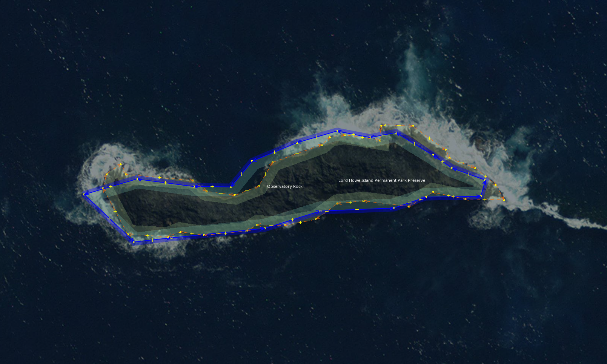

# josm-replace-nodes

A JOSM plugin to replace the nodes of a way, with the nodes of another way.

## Background
The utilsplugin2 JOSM plugin has a neat "Replace geometry" tool, that allows you to draw a new way, and use it to "replace geometry" of an existing uploaded object. This practice helps to [keep the history](https://wiki.openstreetmap.org/wiki/Keep_the_history).

However that tool will refuse to operate on two existing ways, it requires one to be newer, but sometimes when mapping we want to use the geometry from one way, but retain the way history from other.

Hence this tool was born, by way of a few LLM prompts, to fulfil that requirement.

## Example
Take this example where we have the original `natural=coastline` way added to OSM many years ago, and another `boundary=protected_area` way imported more recently. If we decide to instead want to use the original `natural=coastline` as the `boundary=protected_area` way, we may select both and apply this tool, resulting in a way that has the history of the `natural=coastline` but uses the nodes from the imported `boundary=protected_area` way while still retaining any relation memberships.

<figure>
  
  <figcaption>JOSM Screenshot of two ways to be merged using the josm-replace-nodes tool. Image Credit: Aerial Imagery CC BY 4.0, Department of Customer Service (NSW, AU). Data OpenStreetMap Contributors, CAPAD.</figcaption>
</figure>

## How to build and install
```sh
make build
make install
```

Then in JOSM, enable the plugin via Preferences > Plugins.
